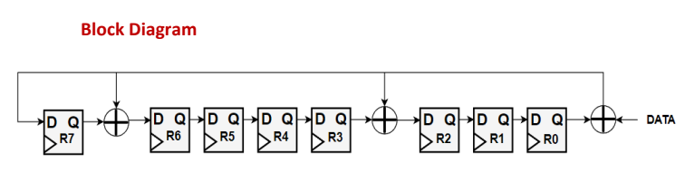

# Linear-Feedback-Shift-Register
The LFSR is a shift register that has some of its outputs together in exclusive- OR or exclusive-NOR configurations to form a feedback path.

## Block Diagram
 *CRC*
